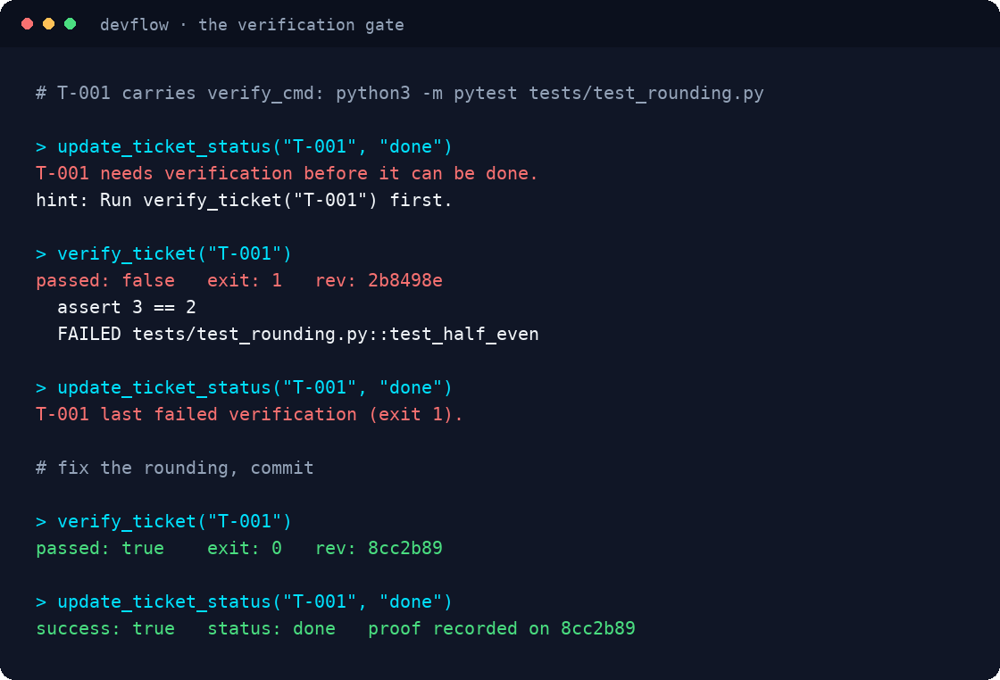
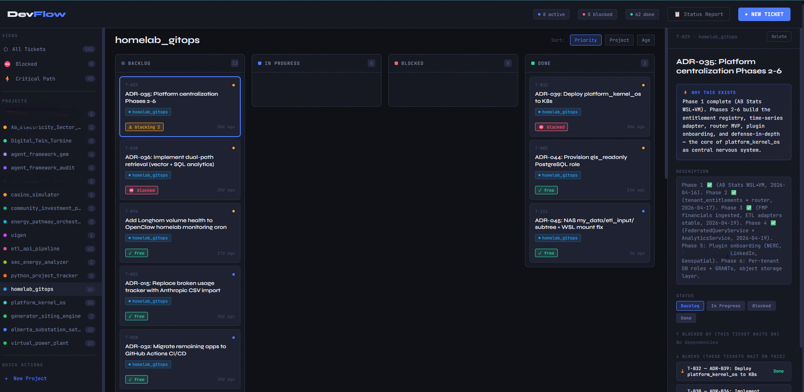

<div align="center">


[](https://github.com/PyGuy2000/devflow-mcp/actions/workflows/ci.yml)
[](https://github.com/PyGuy2000/devflow-mcp/tags)
[](LICENSE)
[](#requirements)

[](https://code.claude.com/docs/en/plugins)
[](#tools)
[](#running-the-tests)
[](#file-structure)

**[What it does](#what-it-does)** · **[Tools](#tools)** · **[The why field](#the-why-field)** · **[Verification gate](#verification-gate)** · **[Install](#installation)** · **[Web UI](#web-ui)**

</div>

---

Solo workflow tracker for AI coding agents. Tracks tickets, priorities, dependencies, and blocked work across multiple projects via the Model Context Protocol.

Built for Claude Code. Works with any MCP-compatible client.

Ships alongside [K-mem](https://github.com/PyGuy2000/k-mem), which installs it as a dependency.

## What it does

DevFlow gives your AI agent a persistent to-do list and project portfolio. The agent can create tickets, track dependencies, check what's blocked, and get a status report at the start of every session.

State lives in a single JSON file. No database, no containers, no migrations.

All writes go through a lock-and-atomic-replace path (`state_store.py`), not an in-memory load/rewrite. That fix exists because the earlier pattern silently dropped tickets when more than one server process wrote at the same time — this repo's own worst bug. `test_concurrency.py` exercises it directly.

On top of that, every write is checked against the on-disk store before it's allowed: a write is refused if it would zero out a non-empty store, shrink the ticket count by more than half, or lower the monotonic `next_id`. Two real incidents made this rule — a stale browser tab replaying an old snapshot, and a second dashboard process starting up on the same machine. Both die at this check now instead of on disk. A deliberate reset (e.g. wiping a test install) needs `DEVFLOW_ALLOW_DESTRUCTIVE_WRITE=1`. Every replaced state is also copied to `backups/` first (last 30 kept), so even a permitted destructive write is one file-copy away from undo.

The web UI server (`http_api.py`) also refuses to double-launch: it doesn't set `SO_REUSEADDR`, so starting a second instance on the same port fails immediately with a clear error instead of silently binding — nothing touches the state file until a real request arrives.

## Tools

18 MCP tools organized in tiers:

### Daily work (Tier 1)
- `create_project` — register a project with a name, goal, and optional `repo_path`
- `add_ticket` — create a ticket with title, rationale ("why"), priority, optional blockers, and an optional `verify_cmd`
- `update_ticket_status` — move tickets between backlog, active, blocked, done; a `done` transition reports any blocked tickets whose blockers are now all resolved, and is refused if the ticket's `verify_cmd` has not passed on the current revision
- `verify_ticket` — run a ticket's `verify_cmd` and record the exit code, output tail, and git revision as proof on the ticket
- `list_tickets` — query tickets with project/status/priority filters
- `get_ticket` — full context for one ticket: fields, complete work log, dependencies resolved to titles/statuses
- `log_work` — append a timestamped work note to a ticket's log (progress, findings, session-handoff breadcrumbs)
- `edit_ticket` — modify ticket fields
- `delete_ticket` — remove a ticket and clean up dependency references

### Project queries (Tier 2)
- `get_project` — get a project and all its tickets
- `add_dependency` — link tickets (T-005 is blocked by T-002)
- `remove_dependency` — unlink tickets
- `archive_project` — archive a completed project (all tickets must be done)

### Portfolio (Tier 3)
- `search_tickets` — keyword search across all projects
- `get_blocked` — show all blocked tickets with dependency chains
- `get_status_report` — full portfolio view: active work, blocked tickets, ready-to-unblock tickets, stale actives, WIP warning, dependency trees, stale project alerts

### Ticket hygiene

The status report flags workflow rot:

- `stale_active` — active tickets with no log entry in `stale_active_days` (default 14). The fix is `log_work` (if you're actually working on it) or demote to backlog.
- `wip_warning` — set when active count exceeds `wip_limit` (default 10).
- `ready_to_unblock` — blocked tickets whose blockers are all done. Externally blocked tickets (empty `blockedBy`) are excluded.

Both thresholds are configurable in `config.json` (`stale_active_days`, `wip_limit`). The session-start hook shows the same signals: `[idle Nd]` markers on stale actives and a "Ready to unblock" section.

### Ingestion (Tier 4)
- `ingest_manifest` — import tickets from a `devflow.json` file

### Scanning (Tier 5)
- `scan_project` — read a project's `docs/project_notes/decisions.md`, parse ADRs, cross-reference against existing tickets, and create missing ones

## The "why" field

Every ticket requires a `why` field: why the work exists and what it unblocks. The AI reads these tickets. A clear rationale produces better implementation decisions than a task title alone.

```json
{
  "id": "T-042",
  "title": "Add persistent volume to data directory",
  "why": "Processing history lost on pod restart. Blocks reliable onboarding.",
  "priority": "high",
  "status": "done",
  "blockedBy": [],
  "blocksTickets": ["T-043"]
}
```

## Verification gate

<div align="center">



*Captured from a real run against a throwaway repo, not written by hand.*

</div>

A ticket can carry a `verify_cmd`: one shell command that proves the work is finished.

```python
add_ticket(
    title="Build ADR-110 governance checks",
    why="ADR-110 ships no check. The rule decays until one exists.",
    project="my_app",
    verify_cmd="pytest tests/test_governance_checks.py -q",
)
```

`verify_ticket` runs that command in the project's `repo_path` and writes the result onto the ticket:

```json
"verified": {
  "cmd": "pytest tests/test_governance_checks.py -q",
  "exit": 0,
  "rev": "b8e0d41",
  "tail": "3 passed in 1.4s",
  "durationSec": 1.5
}
```

`update_ticket_status(..., "done")` then requires three things: a stored result, exit 0, and a `rev` equal to the current `git rev-parse --short HEAD`. That third condition is the one that earns its keep. Tests pass, the agent makes one more cleanup commit, and the proof no longer applies:

```
{"error": "T-042 proof is stale: it passed on a3f91c2, HEAD is now b8e0d41.",
 "hint": "Re-run verify_ticket(\"T-042\")."}
```

Tickets with no `verify_cmd` behave exactly as before. The field is opt-in per ticket, there is no migration, and old tickets keep closing on a plain status change.

When a check genuinely cannot run, close the ticket with a reason:

```python
update_ticket_status("T-042", "done", waiver="checker needs a live k8s context, ran manually")
```

The transition succeeds and the ticket log keeps the sentence `WAIVED verification: checker needs a live k8s context, ran manually` permanently. Without an escape hatch, a gate that blocks one legitimate close gets switched off for every ticket.

Two limits worth knowing. If the agent writes both the ticket and its `verify_cmd`, it can pick a weak command; `verify_cmd: "true"` passes. Storing the command on the ticket makes a lazy one visible on the board, which is the extent of the protection. And a project with no `repoPath`, or a `repoPath` that is not a git checkout, records `rev: null` and skips the staleness check while still requiring exit 0.

`get_status_report` lists gated tickets with no green run under `needs_verification`, and the session-start hook marks them `[unverified]`, `[verify failing: exit N]`, or `[verified b8e0d41]`.

## ADR scanning

The `scan_project` tool reads a project's Architectural Decision Records and backfills missing DevFlow tickets. It handles two ADR header formats (`##` and `###`), extracts dates from headers or body fields, and uses heuristics to classify each ADR as outstanding or completed.

```python
# Dry run: see what's missing without creating tickets
scan_project(path="~/code/my-project", dry_run=True)

# Create backlog tickets for outstanding ADRs
scan_project(path="~/code/my-project", project="my_project", dry_run=False)

# Full sync: also create done tickets for implemented ADRs
scan_project(path="~/code/my-project", project="my_project", dry_run=False, include_completed=True)
```

Outstanding work heuristics:
- Explicit status markers: "Status: Research", "Status: Proposed", "Status: Draft"
- Phase/rollout plans: "Migration Sequence", "ML Transition Path"
- Future-tense language: "will be", "blocked on", "deferred", "not yet implemented"
- Rolling 30-day window: recent ADRs with any future-tense marker are flagged

Cross-project deduplication: if any ticket in any project already references an ADR ID in its title, that ADR is skipped.

## Installation

Prerequisites: Python 3.11 or newer on PATH as `python3`, and the `mcp` package for that interpreter:

```bash
python3 -m pip install "mcp<2"
```

The pin matters. `mcp` 2.0 renamed `FastMCP` to `MCPServer` and changed other
APIs, so `pip install mcp` gets 2.x and `server.py` fails to import. Migrating
is on the list; until then, install 1.x.

### As a Claude Code plugin (recommended)

DevFlow is published through the K-mem marketplace. Two commands install the MCP server and the session-start hook:

```bash
claude plugin marketplace add PyGuy2000/k-mem
claude plugin install devflow@k-mem
```

Nothing in your settings files is edited. State and config live in `~/.config/devflow-mcp/`; the first session creates that directory and copies `config.example.json` into it as `config.json`. Set `DEVFLOW_CONFIG_DIR` to put them somewhere else.

### By hand

```bash
git clone https://github.com/PyGuy2000/devflow-mcp.git ~/devflow-mcp
```

Add to Claude Code settings (`~/.claude/settings.json`):

```json
{
  "mcpServers": {
    "devflow": {
      "command": "python3",
      "args": ["/path/to/devflow-mcp/server.py"]
    }
  }
}
```

Replace `/path/to/` with the actual path. Wire `hooks/session-status.py` as a SessionStart hook the same way (`hooks/hooks.json` shows the entry).

## Session-start hook

The `hooks/session-status.py` script prints a quick status summary when Claude Code starts (the plugin wires it for you):

```
DevFlow: 6 active, 5 blocked, 23 backlog, 21 done
  Active:
    T-088 [high] Add email bridge to CRM sync (unblocks: T-091)
    T-092 [medium] Build monitoring dashboard page
```

On the first run it also creates `~/.config/devflow-mcp/config.json` and tells you if the `mcp` package is missing.

## ADR index

`refresh_adr_index` builds `adr_index.json`: every ADR across your repos with a collision-proof uid (`<project>:ADR-NNN`), a Layer x Domain classification, a resolved status, and typed edges to other ADRs and to tickets. `list_adrs` filters it; `get_adr` returns one record in full. The web UI renders it as the Decisions view.

Which repos are indexed: every project's `repo_path`, plus every directory one level under each entry of `adr_repo_roots` in `config.json`. The Layer axis is fixed (ui, chatbot, agentic, etl, datasets, plugins-engines, infra, security, ops). The Domain axis is yours:

```json
{
  "adr_repo_roots": ["~/code"],
  "adr_exclude_dirs": ["old-worktree"],
  "adr_exclude_path_parts": ["docs_preview"],
  "adr_overrides_file": "",
  "adr_domains": {"billing": "Billing", "platform": "Platform"},
  "adr_project_domains": {"my_app": "billing", "my_infra": "platform"},
  "adr_domain_keywords": {"billing": ["invoice", "tax table"]},
  "adr_layer_keywords": {"agentic": ["my-bot-name"]}
}
```

An ADR can also carry `**Layer:**` and `**Domain:**` lines of its own; those win over everything. Corrections for the rest go in the overrides file (`adr_categories.json` beside the state file unless `adr_overrides_file` says otherwise): `python3 adr_index.py --review-csv sheet.csv` dumps the guesses, you fill in the sheet, `python3 adr_apply_review.py` applies it.

## Web UI

An optional HTTP server (`http_api.py`) serves a dark-themed dashboard on port 7117:

```bash
python3 http_api.py
# Open http://localhost:7117
```

The UI shows all projects, tickets, and status filters. No authentication (localhost only). Includes a global search across all projects, including ticket work logs.



## GitHub activity sync

`github_activity_sync.py` is a standalone script (not an MCP tool — run it as a cron job) that polls your GitHub repos via the `gh` CLI and writes commits/PRs into the ProjectHub database, matching each repo to a project by URL or name. It adds `last_commit_date`, `open_pr_count`, and `commits_this_week` columns so a portfolio view can show which projects have actually moved recently versus which are just sitting in the tracker.

```bash
python3 github_activity_sync.py --dry-run          # preview matches without writing
python3 github_activity_sync.py                    # full sync, all your repos
python3 github_activity_sync.py --repo you/one-repo # sync a single repo
```

Requires `gh auth login`. Only meaningful if you're using the ProjectHub bridge — like the bridge itself, it needs a `projecthub.db` to write into.

## ProjectHub bridge

DevFlow can optionally sync ticket state to an external SQLite database for time tracking and portfolio health. When a ticket moves to "active," a time entry starts. When it moves to "done," the timer stops and hours are calculated, capped at `max_timer_hours` (default 8) so a ticket left active for weeks can't book that whole span as work. Demoting an active ticket back to backlog or blocked — or deleting it — cancels the timer without billing the elapsed time.

The bridge also computes a health score (0-10) per project from activity recency, deadline proximity, documentation completeness, and dependency status.

The bridge is private and not included in this repository — it is tightly coupled to a specific project management schema. The core MCP server (`server.py`) works fully without it: if `projecthub_db_path` in `config.json` is empty or the file does not exist, the bridge is silently disabled.

Configure in `~/.config/devflow-mcp/config.json` (`config.example.json` documents every key):

```json
{
  "projecthub_db_path": "/path/to/your/projecthub.db",
  "auto_time_entries": true,
  "default_classification": "personal",
  "stale_active_days": 14,
  "wip_limit": 10,
  "max_timer_hours": 8.0,
  "verify_timeout_sec": 600,
  "api_token": ""
}
```

`api_token` gates the web UI's mutating routes (ticket creation, index refresh). It stays in this file on purpose: Claude Code strips environment variables whose names look like credentials from plugin MCP servers, so an env var would never reach the server.

## Manifest ingestion

Projects can declare their tickets in a `devflow.json` file:

```json
{
  "project": "my_project",
  "goal": "Build a data pipeline",
  "tickets": [
    {
      "title": "Set up ingestion service",
      "why": "No automated data flow exists yet",
      "priority": "high",
      "status": "backlog"
    }
  ]
}
```

Ingest with `ingest_manifest(path="/path/to/devflow.json")`. Duplicate titles are skipped.

## Works with project-memory

DevFlow pairs well with the [`project-memory`](https://github.com/SpillwaveSolutions/project-memory) skill from SpillwaveSolutions. That skill creates 4 markdown files in each repo (`docs/project_notes/bugs.md`, `decisions.md`, `key_facts.md`, `issues.md`) and configures the AI to reference them.

The `scan_project` tool reads `decisions.md` directly, closing the loop between project memory and DevFlow.

Typical `CLAUDE.md` rules for integration:

```
When writing a new ADR in decisions.md:
- Create a DevFlow ticket for the implementation work

When a DevFlow ticket is marked done:
- Log the completion in issues.md

Periodically:
- Run scan_project to backfill any ADRs that were missed
```

## File structure

```
devflow-mcp/
  .claude-plugin/plugin.json # plugin manifest (name devflow)
  .mcp.json                  # the MCP server entry the plugin wires
  server.py                  # MCP server (18 tools)
  state_store.py             # Lock + atomic-replace state persistence
  devflow_config.py          # config.json loader shared by every entry point
  adr_index.py               # ADR index builder (refresh_adr_index)
  adr_categories.py          # Layer x Domain classifier; domains from config.json
  adr_parse.py               # ADR text parsing shared by scan_project and the index
  adr_apply_review.py        # apply a reviewed category sheet to the overrides file
  github_activity_sync.py    # Optional: cron script, syncs GitHub commits/PRs into ProjectHub
  http_api.py                # Optional web UI server
  devflow.html               # Web UI (dark theme, served by http_api.py)
  config.example.json        # every config key; copied to ~/.config/devflow-mcp/config.json on first run
  test_concurrency.py        # Exercises the lock under concurrent writers
  test_stale_write_guard.py  # Exercises the HTTP API's stale-snapshot rejection (409)
  test_tools.py              # get_ticket, log_work, stale-active/WIP/ready-to-unblock
  test_verifier.py           # verify_ticket, the done gate, revision staleness, waivers
  test_adr_config.py         # ADR discovery, domains and overrides from config.json
  test_mcp_stdio.py          # the server over stdio from an empty state dir: a project and a ticket
  hooks/
    hooks.json               # the plugin's SessionStart entry
    session-status.py        # first-run setup + status summary
```

## Running the tests

Each test file is a standalone script, not a pytest suite — running them together under one `pytest` collection can make one file's imports leak into another's, since `server`/`state_store` bind their state-file path once, at first import. Run them one at a time:

```bash
python3 test_tools.py
python3 test_verifier.py
python3 test_stale_write_guard.py
python3 test_concurrency.py
python3 test_adr_config.py
python3 test_mcp_stdio.py
```

Each builds its own temp state file and cleans up after itself; none of them touch your real `devflow_state.json`.

## Requirements

- Python 3.11+
- `mcp` 1.x, installed as `pip install "mcp<2"`. The 2.0 release renamed `FastMCP` to `MCPServer`; `server.py` still imports the 1.x name.
- No other dependencies

## Limitations

- Solo tool. No multi-user support, no authentication, no sync.
- JSON state file. Works for hundreds of tickets across dozens of projects. Would need a database for larger scale.
- ADR scanning heuristics are tuned for the `project-memory` format. Other ADR formats may need adjustments to the parser.
- MCP protocol support required. Works with Claude Code and Claude Desktop.

## License

MIT
